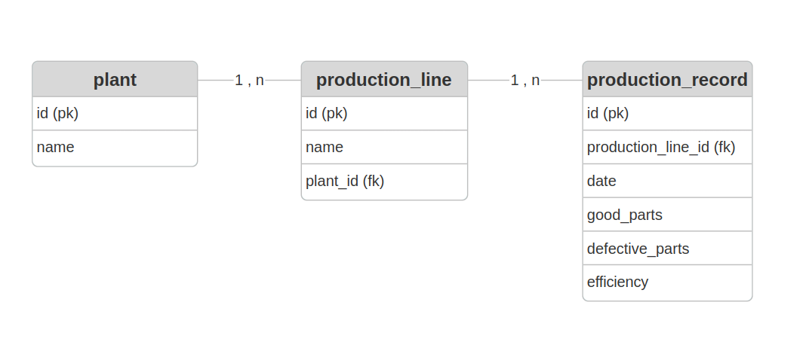

# Dashboard LG

Projeto Laravel 7 com MySQL 8 usando Docker.

## Requisitos

- [Docker](https://docs.docker.com/get-docker/)
  - **Windows/Mac**: Docker Desktop já inclui o Docker Compose V2
  - **Linux**: Instalar também o [Docker Compose Plugin](https://docs.docker.com/compose/install/linux/)

## Instalação

1. Clone o repositório e acesse a pasta do projeto:
```bash
git clone <link-do-repositorio-no-github>
cd Dashboard-LG
```

2. Construa e suba os containers (Laravel será instalado automaticamente):
```bash
docker compose up -d
```

3. Aguarde o MySQL estar pronto (10-15 segundos) e configure o Laravel:
```bash
# Copiar configurações do .env
docker compose exec app cp .env.example .env

# Gerar chave da aplicação
docker compose exec app php artisan key:generate

# Limpar cache e reiniciar
docker compose exec app php artisan config:clear
docker compose restart app

# Executar migrações
docker compose exec app php artisan migrate

# Popular banco de dados com dados de exemplo
docker compose exec app php artisan db:seed
```

## Uso

A aplicação estará disponível em: http://localhost:8000

## Reinstalação

Caso precise reinstalar as imagens e containers, antes do passo 2 da instalação rode:
```bash
docker compose down -v
docker compose build --no-cache
```

## Troubleshooting

### Container reiniciando constantemente

Se o erro `Container is restarting, wait until the container is running` persistir após 15 segundos:

**Sintoma**: Logs mostram `php > Interactive shell` repetidamente

**Solução**:

```bash
# 1. Parar e remover tudo
docker compose down -v

# 3. Reconstruir do zero
docker compose build --no-cache

# 4. Subir containers
docker compose up -d

# 5. Verificar logs (Ctrl+C para sair)
docker compose logs -f app
```

**Verificação**: Os logs devem mostrar:
```
Laravel development server started: http://0.0.0.0:8000
```

Se o problema persistir, verifique:
- Arquivo `Dockerfile` existe e está correto
- Arquivo `docker-compose.yml` existe e está correto
- Compartilhe os logs completos para análise

### Outros problemas comuns

**Container parado após inicialização**:
```bash
docker compose start
```

**Reinstalação completa**:
```bash
docker compose down -v
docker compose build --no-cache
docker compose up -d
```

## Estrutura de Dados

O sistema possui dados de exemplo de janeiro/2025 a janeiro/2026 para:
- **Plant A** com 4 linhas de produção:
  - Geladeira
  - Máquina de Lavar
  - TV
  - Ar-Condicionado
- Registros diários de produção (dias úteis) contendo:
  - Peças boas produzidas
  - Peças defeituosas
  - Eficiência calculada

## Tecnologias

- Laravel 7
- PHP 7.4
- MySQL 8.0
- Docker
- Docker Compose V2

## Desenvolvimento

### Docker

O projeto roda com docker para facilitar a utilização das versões específicas de tecnologias aplicadas a este sistema. Além disso o docker compose faz todo o trabalho de instalar e configurar os sistemas aplicados nesse projeto.

### Banco de dados

O diagrama do Banco de Dados ficou com a seguinte estrutura. 



O objetivo de ter a tabela plant é simular a acomodação de um possível crescimento do sistema em que se é possível adicionar novas plantas apenas incluindo um novo registro nessa tabela.

### Dados para o teste do projeto

Os dados são criados à partir de seeders e não precisam ser adicionados manualmente.

### Recriar banco de dados

Este procedimento apagará todos os registros anteriores e populará novamente o banco de dados. Se precisar recriar o banco do zero:
```bash
docker compose exec app php artisan migrate:fresh --seed
```

### Sistema de Filtros

O projeto implementa um sistema de filtros seguindo o padrão `filter[campo]`, compatível com bibliotecas como **Spatie Query Builder**. 
Apensar de no momento atual não estar incorporada a biblioteca, a adoção deste padrão permitiria uma migração fácil caso houvesse a necessidade.

#### Filtros Disponíveis

O dashboard oferece 4 tipos de filtros que podem ser combinados:

1. **Linha de Produção** (`filter[production_line_id]`)
   - Filtra dados por linha específica (Geladeira, Máquina de Lavar, TV, Ar-Condicionado)
   - Valor: ID numérico da linha
   - Default: Todas as linhas

2. **Data Inicial** (`filter[start_date]`)
   - Define o início do período de análise
   - Formato: YYYY-MM-DD
   - Default: Primeiro dia do mês atual (Janeiro/2026 nos dados de exemplo)

3. **Data Final** (`filter[end_date]`)
   - Define o fim do período de análise
   - Formato: YYYY-MM-DD
   - Default: Último dia do mês atual (31/Janeiro/2026 nos dados de exemplo)

4. **Eficiência Mínima** (`filter[min_efficiency]`)
   - Filtra apenas linhas com eficiência igual ou superior ao valor especificado
   - Valor: Número decimal (0-100)
   - Exemplo: 85 retorna apenas linhas com ≥85% de eficiência

#### Como Usar os Filtros

**Via Interface Web:**
- Preencha os campos desejados no formulário de filtros
- Clique em "Aplicar Filtros"
- Os filtros ativos aparecem como badges abaixo do formulário
- Use "Limpar Filtros" para resetar todos os filtros

**Via URL (Query String):**
```
http://localhost:8000/dashboard?filter[production_line_id]=1&filter[start_date]=2026-01-01&filter[end_date]=2026-01-31&filter[min_efficiency]=90
```

#### Arquitetura do Sistema de Filtros

O sistema foi projetado seguindo boas práticas de desenvolvimento:

**1. Padrão de URL (`filter[campo]`)**
- Compatível com Spatie Query Builder
- Facilita migração futura para bibliotecas de filtros
- URL limpa e semântica
- Suporta múltiplos filtros simultâneos

**2. Separação de Responsabilidades**

```php
// Controller: Extrai e valida filtros
DashboardController::extractFilters()

// Service: Aplica filtros na query
ProductionService::applyFilters()

// Service: Formata filtros ativos para exibição
ProductionService::getActiveFilters()
```

#### Migração Futura para Spatie Query Builder

O sistema já está preparado para migração futura para [Spatie Query Builder](https://github.com/spatie/laravel-query-builder):

**Benefícios do Spatie:**
- Validação automática de filtros
- Suporte a relacionamentos
- Filtros por escopo (scopes)
- Ordenação e inclusão de relacionamentos
- Documentação extensa

**Quando migrar:**
- Quando houver necessidade de filtros mais complexos
- Para APIs RESTful com múltiplos recursos
- Quando precisar de filtros por relacionamentos
- Para aproveitar recursos avançados (includes, sorts, etc.)

### Componentização do frontend

O projeto utiliza Blade Components para organizar melhor a estrutura do frontend:

#### ConsolidatedCards Component
- **Propósito**: Encapsula os cards com métricas consolidadas (Total Produzido, Peças Boas, Peças Defeituosas, Eficiência Média)
- **Props**: `$consolidated` (Array com dados consolidados)
- **Uso**: `<x-consolidated-cards :consolidated="$consolidated" />`

#### ProductionTable Component
- **Propósito**: Encapsula a tabela de detalhamento por linha de produção
- **Props**: `$productionData` (Collection de dados das linhas)
- **Uso**: `<x-production-table :productionData="$productionData" />`

#### ProductionChart Component
- **Propósito**: Encapsula o gráfico de eficiência por linha
- **Props**: 
  - `$productionData` (Collection de dados das linhas)
  - `$chartId` (ID do canvas, default: 'efficiencyChart')
- **Uso**: `<x-production-chart :productionData="$productionData" />`

**Benefícios da componentização:**
- Melhor organização e separação de responsabilidades
- Código reutilizável
- Facilita manutenção e testes
- Sintaxe mais limpa na view principal

### Utilização da biblioteca Chart.js

O projeto utiliza **Chart.js v3.9.1** para renderização dos gráficos de eficiência.

#### O que é Chart.js?

Chart.js é uma biblioteca JavaScript open-source para criação de gráficos interativos em HTML5 Canvas. É uma das bibliotecas de visualização de dados mais populares devido à sua simplicidade e flexibilidade.

#### Características principais:
- **8 tipos de gráficos**: Line, Bar, Radar, Doughnut, Pie, Polar Area, Bubble e Scatter
- **Responsivo**: Gráficos adaptam-se automaticamente ao tamanho do container
- **Animações**: Transições suaves e configuráveis
- **Customizável**: Cores, tooltips, legendas e eixos totalmente personalizáveis
- **Leve**: ~60KB minificado
- **Sem dependências**: Funciona sem jQuery ou outras bibliotecas

#### Por que escolhemos Chart.js?

1. **Simplicidade**: API intuitiva e fácil de implementar
2. **Documentação**: Extensa documentação oficial com exemplos práticos
3. **Performance**: Renderização rápida mesmo com grandes volumes de dados
4. **Compatibilidade**: Funciona em todos os navegadores modernos
5. **Comunidade ativa**: Amplo suporte da comunidade e atualizações frequentes
6. **Gratuito**: Licença MIT permite uso comercial sem restrições

#### Implementação no projeto

O gráfico de eficiência é implementado em `/public/js/dashboard-chart.js`:

```javascript
// Configuração do gráfico de barras
new Chart(canvas, {
    type: 'bar',
    data: {
        labels: ['Geladeira', 'Máquina de Lavar', 'TV', 'Ar-Condicionado'],
        datasets: [{
            label: 'Eficiência (%)',
            data: [95.5, 92.3, 97.8, 89.2],
            backgroundColor: ['#198754', '#ffc107', '#198754', '#dc3545']
        }]
    },
    options: {
        responsive: true,
        scales: {
            y: {
                beginAtZero: true,
                max: 100
            }
        }
    }
});
```

#### Funcionalidades utilizadas:
- **Gráfico de barras** para visualizar eficiência por linha
- **Cores dinâmicas** baseadas em thresholds (verde ≥95%, amarelo ≥90%, vermelho <90%)
- **Tooltips personalizados** exibindo valores formatados
- **Responsividade** automática ao redimensionar a janela
- **Eixo Y limitado** de 0% a 100% para melhor visualização

#### Alternativas consideradas:
- **Highcharts**: Mais robusto mas pago para uso comercial
- **D3.js**: Mais poderoso mas curva de aprendizado maior
- **Google Charts**: Dependente de conexão externa com o Google
- **ApexCharts**: Excelente alternativa, mas Chart.js tem comunidade maior

**Conclusão**: Chart.js oferece o melhor equilíbrio entre facilidade de uso, performance e funcionalidades para as necessidades deste projeto.

### Teste Funcionais e Unitários

O projeto possui uma suíte de testes automatizados cobrindo as principais funcionalidades.

#### Executar todos os testes

```bash
docker compose exec app php artisan test
```

#### Executar apenas testes unitários

```bash
docker compose exec app php artisan test --testsuite=Unit
```

#### Executar apenas testes de feature

```bash
docker compose exec app php artisan test --testsuite=Feature
```

#### Cobertura dos Testes

Os testes cobrem:
- Criação de registros nos modelos
- Relacionamentos entre modelos
- Cálculo de eficiência
- Consultas e agregações de dados
- Filtros por data e eficiência
- Filtros por linha de produção
- Exibição de dados no dashboard
- Aceitação de parâmetros via query string

#### Executar testes específicos

Para executar um arquivo de teste específico:

```bash
docker compose exec app php artisan test tests/Unit/PlantTest.php
```

Para executar um teste específico:

```bash
docker compose exec app php artisan test --filter=it_can_create_a_plant
```

#### Debug de Testes

Para ver output detalhado durante a execução dos testes:

```bash
docker compose exec app php artisan test --verbose
```

Para executar apenas testes que falharam na última execução:

```bash
docker compose exec app php artisan test --failed
```

#### Notas sobre os Testes

- Os testes de feature verificam a funcionalidade end-to-end da aplicação
- Os testes unitários focam em componentes isolados (modelos, queries)
- Todos os testes utilizam o trait `RefreshDatabase` para isolar dados de teste
- Os factories garantem dados consistentes e realistas para os testes

